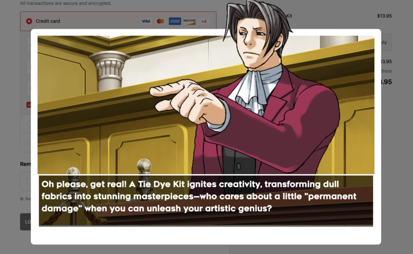

# Dime Defender

We all fall victim to impulse buying and online shopping sprees... especially in the first few weeks of university. A simple budgeting tool or just promising ourselves to spend less doesn't cut it anymore. Sometimes, we need someone — or someone's — to physically stop us from clicking that *BUY NOW* button and talk us through the purchase based on our budget and previous spending. That's where **Dime Defender** comes in.

Drawing on the courtroom drama of legal battles, we infuse an element of fun and accountability into budgeting and mindful spending, so you can make better financial decisions while enjoying the process.

## What It Does

**Dime Defender** is a Chrome extension designed to help you control your online spending. Whenever you're on a Shopify or Amazon checkout page, it locks the *BUY NOW* button and throws you into a courtroom-style scenario! Two lawyers will argue your purchase:

- **Defense Attorney**: explaining why you should steer away from the purchase 😒.
- **Prosecutor**: showing you some potential benefits 😏.

The arguments are based on your monthly budget, previous spending, and the items in your cart. By making you think twice about the pros and cons, **Dime Defender** helps you make more informed, mindful financial decisions before you proceed with any purchase.

## How We Built It

The Dime Defender Chrome extension and frontend were created using **Svelte**, **Plasma**, and **Node.js** to ensure an interactive and sleek user experience. 

The extension is connected to **AWS API Gateways**, which in turn communicate with **AWS Lambda serverless functions** for backend processing. These functions retrieve data from:

- **VoiceFlow** for managing the AI-driven dialogue between the two lawyers.
- **ElevenLabs** for custom text-to-speech (TTS) voiceovers that bring the lawyers to life.

We also use **AWS RDS** and **EC2** for secure storage of user data (like budgets and spending records), ensuring a smooth, real-time experience every time you attempt to check out on any Shopify or Amazon page.

## Challenges We Ran Into

Building a robust Chrome extension that communicates securely with serverless functions posed a unique challenge. We had to devise a system of **Lambda functions**, **API Gateways**, and tight integration with **VoiceFlow** to manage the interactions without exposing sensitive `api_keys`.

Additionally, getting the AI lawyers to argue with distinct personalities and natural tone was no easy feat. It required extensive prompt engineering and iteration to create an engaging user experience.

Debugging animation sprites, handling TTS voice overlap, and addressing latency in API calls were other major challenges we faced, but ultimately overcame.

## Accomplishments That We're Proud Of

One of our biggest accomplishments is the **natural conversational flow** within the extension, with the AI lawyers presenting distinct personalities. Having your cart cross-examined by two AI lawyers is a unique experience, and we’re proud of how enjoyable and engaging the final product turned out.

## What We Learned

We learned to create a distributed system architecture that seamlessly integrates various technologies, ensuring that each one complements the others. Our experience also highlighted the importance of prompt engineering for AI interactions, as well as the fine details required for effective voice-over implementations.

Also... never eat 6.8 million Scoville hot sauce if you plan to code.

## What's Next for Dime Defender

The next step for **Dime Defender** is expanding its reach beyond Shopify and Amazon. We want to support more e-commerce and retail websites to help even more people curb their impulse buying and become more financially responsible.

## Built With

- **Svelte**
- **Plasma**
- **Node.js**
- **AWS Lambda**
- **AWS RDS & EC2**
- **VoiceFlow**
- **ElevenLabs**
